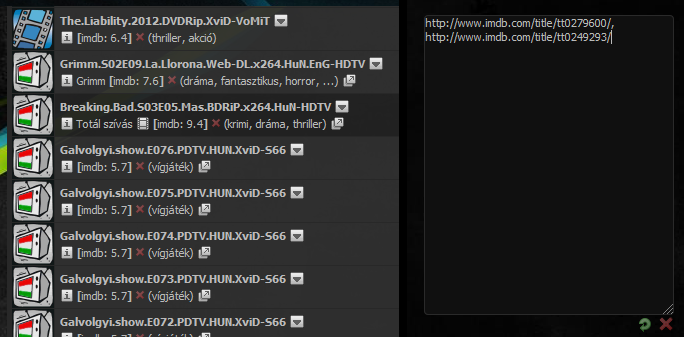
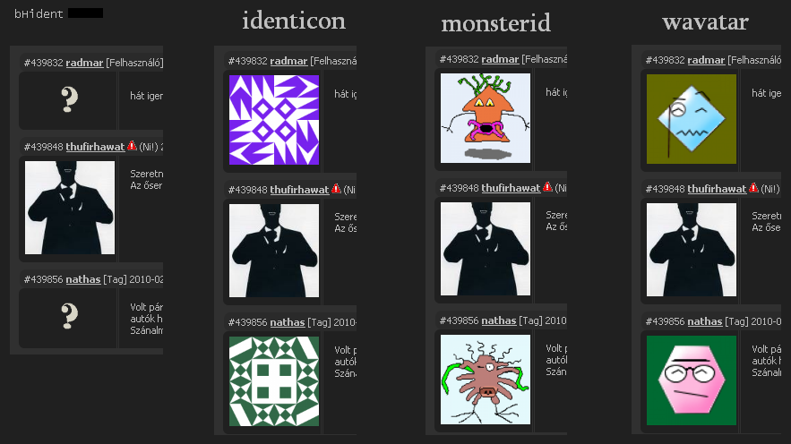
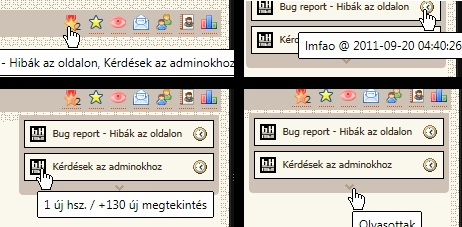
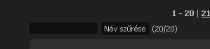
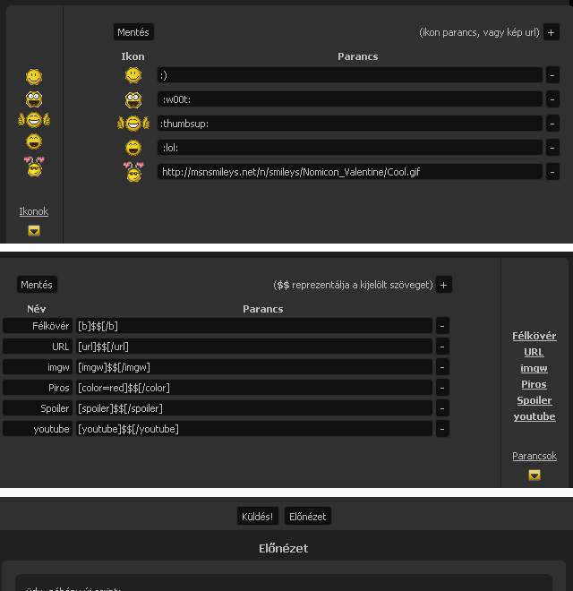
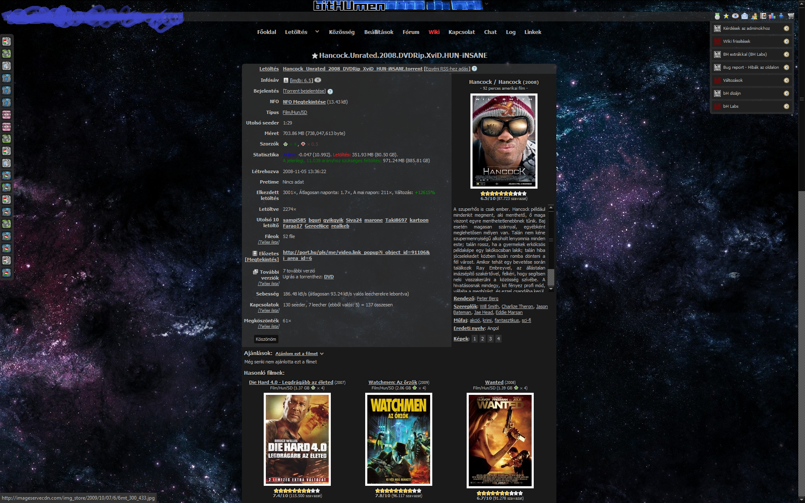
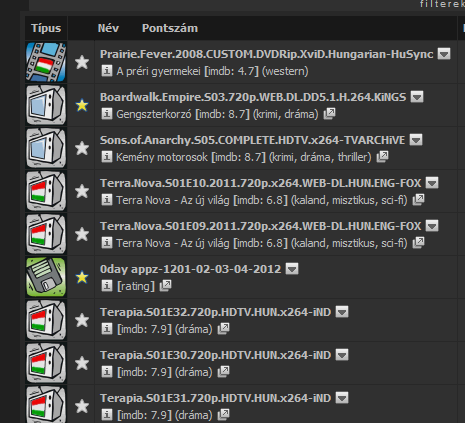
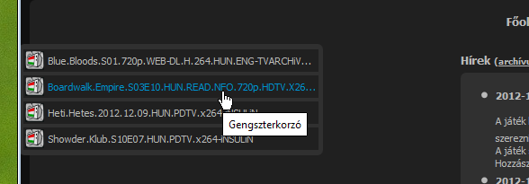
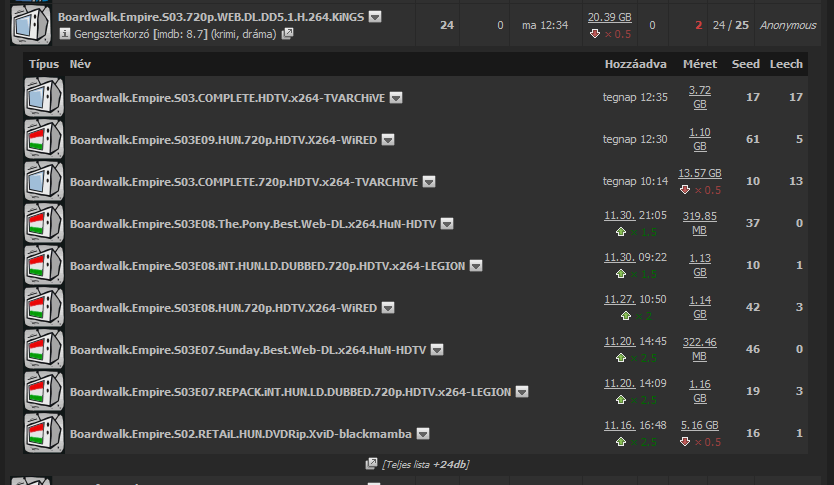
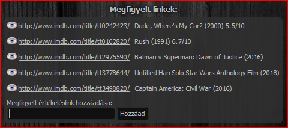

# bH Labs

## [Ajax Lapozó](ajax-lapozo.user.js)
A torrent listánál, borító nézetnél, a fórumban és torrent hozzászólásoknál végtelenített görgetést tesz lehetővé lapozó helyett.  

## [Anticsillagozó](anticsillagozo.user.js)
IMDB link alapján elrejti a nem kívánatos torrenteket.  

## [bH ident](bh-ident.user.js)
Alap kép helyett egyedi avatart kap akinek nincs kép beállítva. Alapbeállítás az identicon.  

## [Csillagozott jelző](csillagozott-jelzo.user.js)
A csillagozott fórum témáidat megjeleníti a státusz sávon egy panelban és jelzi az új fórum hozzászólások / megtekintések számát.  

## [Inbox filter](inbox-filter.user.js)
Segítségével a privát üzenetek között lehetséges feladó / címzett nevére való kereséssel szűkíteni.  

## [Komment Addon](komment-addon.user.js)
Az üzenet küldő űrlap parancsait / ikonjait teszi szerkeszthetővé ill. a kijelölést okosabbá, továbbá előnézetre ad lehetőséget.  

## [Logó elrejtő](logo-elrejto.user.js)
Az oldal tetején lévő logót rejti el.  

## [Nightsurfer Epic Themes](ns-epic-themes.user.js)
Nightsurfer témához kiegészítés. Áttetsző oldal elemeket és HD háttérképeket használ, amit 5 percenként váltogat.  

## [Torrent kiemelő](torrent-kiemelo.user.js)
Kiemeli a megadott névvel, letöltöltésszámmal, vagy seederszámmal rendelkező torrenteket a kiválasztott háttérszínekkel.  

## [Torrent Lista Csillagozó](torrent-lista-csillagozo.user.js)
A torrent listában is megjelenik ha egy torrent a csillagozottak közt van, ill. be lehet állítani.  

## [Torrent Panel](torrent-panel.user.js)
Az új torrenteket jeleníti meg egy kinyló panelon.  

## [További Verziók Doboz](tovabbi-verziok-doboz.user.js)
A további verziókat tölti be közvetlenül a torrent alá.  

## [User bHlokkoló](user-bhlokkolo.user.js)
Elrejti a megadott felhasználók hozzászólásait.  

## [Watchlist IMDB info](watchlist-imdb-info.user.js)
Megfigyelt torrenteknél megjeleníti az imdb infókat.  

